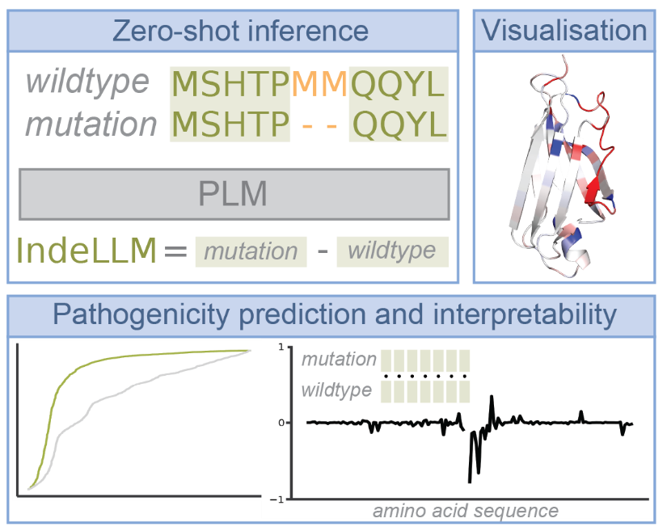

# IndeLLM
Welcome to IndeLLM, an easy and free-to-use indel pathogenicity predictor based on Protein Language Models.

IndeLLM also provides a per-position protein fitness damage score to aid in interpreting the provided predictions. 

A plug-and-play Google Colab can be found at [Colab Notebook](https://colab.research.google.com/drive/1CgwprttaNFR_KeJGyFzP0a0C9Y__wc4P)

The accompanying paper can be found at [BioRxiv Manuscript](https://www.biorxiv.org/content/10.1101/2025.03.12.642715v1)

If you use IndeLLM please cite us.



## Installation

To install IndeLLM first clone the repository.
The required packages can be found on requirements.txt and can be installed with:
```
pip3 install -r requirements.txt
```
To use IndeLLM as a package add the repository to your PYTHONPATH.

## Folder structure and contents

*   The Analysis folder contains the data and jupyter notebooks needed to reproduce the analysis showcased in the paper.

*   The Data folder contains the csv files for all the predictions, sequences used and the train/test/validation data splits used.
More information can be found in the README found inside the Data folder.
*   The Examples folder contains the jupyter notebook and the necessary files to reproduce the data interpretation examples showcased in the paper.
*   The colab folder contains the source code for the provided Google Colab notebook.
*   The models folder contains the trained IndeLLM siamese model.
*   The indellm folder contains the source code for the package. The code is structured in 4 files. berteval.py handles the protein language models; model.py contains the code for the training and inference of the siamese model; scorer.py contains the code for the zero-shot scoring using protein language models; utils.py contains the code to handle and process the sequences.
*   The folder scripts contain example scripts on how to run the different functionality of the code.

## Abstract
Protein language models (PLMs) are increasingly used to assess the impact of genetic variation on proteins. By leveraging sequence information alone, PLMs achieve high performance and accuracy and can outperform traditional pathogenicity predictors specifically designed to identify harmful variants contributing to diseases. PLMs can perform zero-shot inference, making predictions without task-specific fine-tuning, offering a simpler and less overfitting-prone alternative to complex methods. However, studying in-frame insertions and deletions (indels) with PLMs remains challenging. Indels alter protein length, making direct comparisons between wildtype and mutant sequences not straightforward. Additionally, indel pathogenicity is less studied than other genetic variants, such as single nucleotide variants, resulting in a lack of annotated datasets. Despite these challenges, approaches that leverage PLMs through transfer learning have emerged, making it possible to capture the features needed for more accurate predictions. Still, the current approaches are limited in terms of allowed organisms, indel length and interpretability. In this work, we devise a new scoring approach for indel pathogenicity prediction (IndeLLM) that provides a solution for the difference in protein lengths. Our method only uses sequence information and zero-shot inference with a fraction of computing time while achieving performances similar to other indel pathogenicity predictors. We used our approach to construct a simple transfer learning approach for a Siamese network, which outperformed all tested indel pathogenicity prediction methods (Matthews correlation coefficient = 0.77). IndeLLM is universally applicable across species since PLMs are trained on diverse protein sequences. To enhance accessibility, we designed a plug-and-play Google Colab notebook that allows easy use of IndeLLM and visualisation of the impact of indels on protein sequence and structure. 
